# Hi, I'm Leonardo Placidi 👋

🎯 **AI Builder** | **ML Systems, LLMs** | **Quantum Algorithms & Quantum AI** | **Machine Learning Scientist** | **Quantum Computing Researcher** | **Algorithmic Trading Enthusiast**  
📍 Tokyo, Japan  

---

## 🚀 About Me
I work at the intersection of **quantum computing**, **machine learning**, and **financial technology**. My background in **mathematics** and **data science** allows me to bridge theory and practice — from large-scale quantum experiments to market microstructure analytics.
- Bachelor's Degree in Mathematics (110/110, top 20)
- Master's Degree in Data Science (110CumLaude/110, top 8)
- Published researcher [scholar](https://scholar.google.com/citations?user=6c3dbNsAAAAJ&hl=en)
---

## 📂 Selected Projects

### 📈 Quant & Markets
- **[Market Microstructure Toolkit](https://github.com/Gruntrexpewrus/market-microstructure-toolkit)** — Order book snapshots → microstructure features (spread, depth imbalance, OFI, realized variance, microprice). Work in progress with daily commits.
- **[QuantitativeTrading-public](https://github.com/Gruntrexpewrus/QuantitativeTrading-public)** — Open-source notes and experiments: strategy sketches, data handling, research notebooks.
- **[TradersPlayground](https://github.com/Gruntrexpewrus/TradersPlayground)** — Sandbox of utilities and quick experiments for trading research.

### 🧠 AI Tools

- **[ResearchButler](https://github.com/Gruntrexpewrus/ResearchButler)** — A personal “research butler” that fetches daily updates from arXiv, journals, and news on quantum computing. It generates TL;DR summaries, trend visualisations, and even trivia/jokes using a local LLM, all served through a Flask web dashboard with per-user customization.

### 🤖 ML / Research
- **[TrajectoryFor-and-DPP](https://github.com/Gruntrexpewrus/TrajectoryFor-and-DPP)** — Determinantal Point Processes + Transformers for pedestrian trajectory forecasting (ETH/UCY). Final project in Advanced ML at Sapienza. [Published in *Pattern Recognition*](https://www.sciencedirect.com/science/article/pii/S0031320323000730)
- **[MNISQ — Quantum Circuit Dataset](https://github.com/FujiiLabCollaboration/MNISQ-quantum-circuit-dataset)** *(lead author)* — Large-scale dataset for ML on/for quantum computers (with Fujii Lab collaborators). [ArXiv preprint](https://arxiv.org/abs/2306.16627)
- **[scikit-qulacs](https://github.com/Qulacs-Osaka/scikit-qulacs)** *(contributor)* — Quantum neural-network library based on Qulacs.
- **[FromQCtoQML](https://github.com/Gruntrexpewrus/FromQCtoQML)** — Master’s thesis repo: experiments and notes on quantum computing foundations → quantum machine learning.

### 🗄 Data & Systems
- **[SQLandNOSQL_USFlightDatabaseInvestigation](https://github.com/Gruntrexpewrus/SQLandNOSQL_USFlightDatabaseInvestigation)** — SQL/NoSQL exploration on a large US flights dataset.
- **[ThepandemicbehindThePandemic](https://github.com/Gruntrexpewrus/ThepandemicbehindThePandemic)** — Statistical learning project (coursework).

---

## 📚 Notes & Interests
- Currently reading: *High-Frequency Trading* (Aldridge) — applying concepts to live order-book data in the Microstructure Toolkit.
- I keep concise technical notes inside each project’s README and commit history.

---

## 📫 Contact
- **Email:** leonardoplacidi@gmail.com  
- **LinkedIn:** [linkedin.com/in/leonardo-p-570616198](https://www.linkedin.com/in/leonardo-p-570616198/)  
- **GitHub:** [github.com/Gruntrexpewrus](https://github.com/Gruntrexpewrus)

---

## 📊 Daily Metrics

## 📝 Recent Activity
<!--RECENT_ACTIVITY:start-->
<!--RECENT_ACTIVITY:end-->

